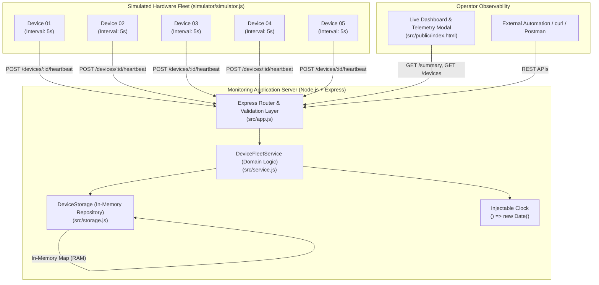
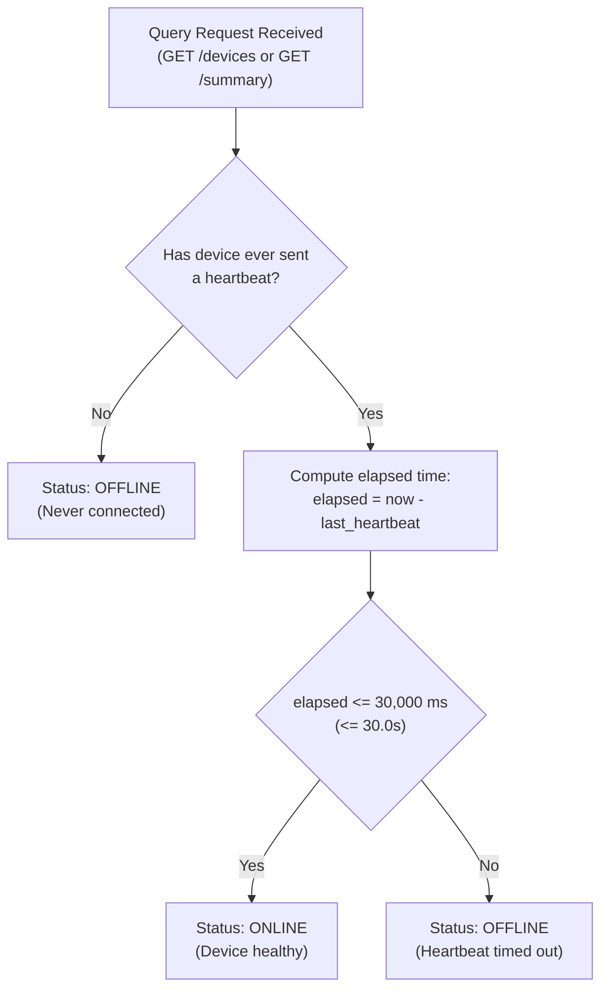
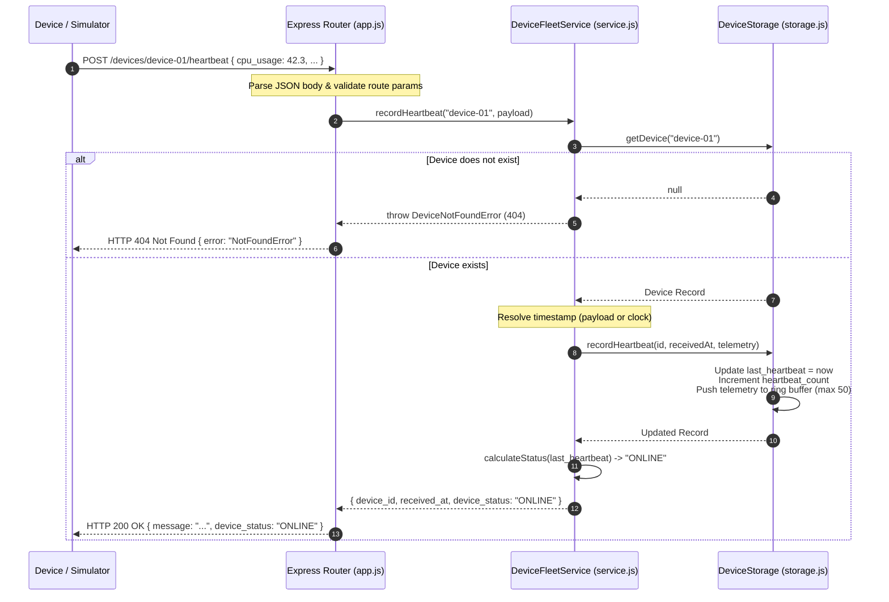
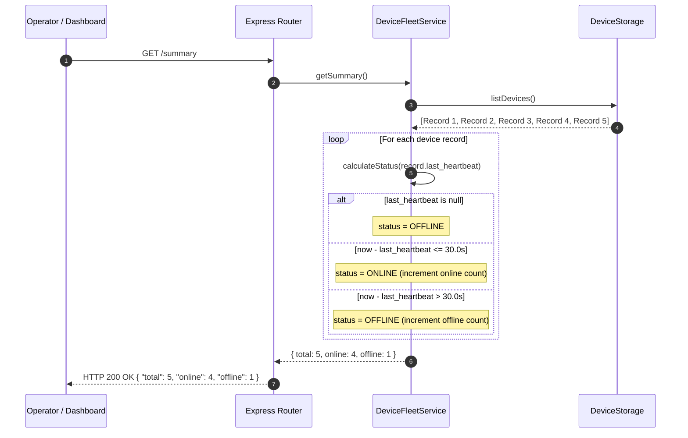
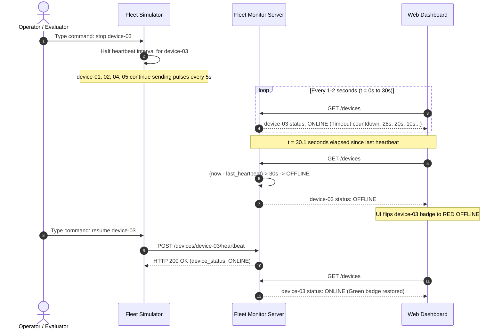

# Mini Device Fleet Monitor (Node.js)

[](https://nodejs.org/)
[](https://expressjs.com/)
[](https://jestjs.io/)
[](https://www.docker.com/)
[]()

A high-performance, production-grade monitoring service developed in **Node.js** for the **Simnovus Campus Hiring Round 2** engineering assessment. The platform tracks a distributed fleet of simulated hardware/IoT devices (such as 4G/5G radio units, test probes, and lab equipment), ingests periodic heartbeat telemetry, dynamically determines operational health (`ONLINE` vs `OFFLINE`) based on a 30-second sliding timeout rule, and provides observability through REST APIs and a live web dashboard.

---

## Table of Contents
1. [What the Project Does](#1-what-the-project-does)
2. [Design and Architecture](#2-design-and-architecture)
   - [System Context & Topology](#21-system-context--topology)
   - [Architectural Layers](#22-architectural-layers)
   - [Dynamic Status Resolution Engine (30s Rule)](#23-dynamic-status-resolution-engine-30s-rule)
   - [Heartbeat Ingestion Sequence Flow](#24-heartbeat-ingestion-sequence-flow)
   - [Timeout Evaluation Decision Flow](#25-timeout-evaluation-decision-flow)
   - [Fault Simulation Lifecycle Flow](#26-fault-simulation-lifecycle-flow)
   - [Concurrency, Big-O Complexity & Memory Safety](#27-concurrency-big-o-complexity--memory-safety)
3. [Prerequisites](#3-prerequisites)
4. [How to Build the Application](#4-how-to-build-the-application)
5. [How to Run the Application](#5-how-to-run-the-application)
6. [How to Run the Simulator](#6-how-to-run-the-simulator)
7. [How to Run the Tests](#7-how-to-run-the-tests)
8. [Example API Requests](#8-example-api-requests)
9. [Assumptions Made](#9-assumptions-made)
10. [Known Limitations](#10-known-limitations)
11. [What I Would Improve With One Additional Day](#11-what-i-would-improve-with-one-additional-day)
12. [AI Usage](#12-ai-usage)
13. [Project Directory Structure](#13-project-directory-structure)

---

## 1. What the Project Does

In telecommunications and distributed hardware testing (such as Simnovus test suites), edge hardware devices continuously run long-duration workloads. To maintain operational awareness, every device periodically transmits a lightweight **heartbeat** packet to a centralized monitoring server.

This project delivers:

1. **Device Registration**:
   - Allows network operators and automated test harnesses to onboard hardware devices using unique IDs and descriptive names via `POST /devices`.
   - Prevents duplicate registrations with strict uniqueness constraints and HTTP `409 Conflict` responses.

2. **Heartbeat & Telemetry Ingestion**:
   - Ingests real-time heartbeat packets via `POST /devices/:id/heartbeat`.
   - Supports ISO-8601 UTC timestamps, operational status codes (`OK`, `WARNING`, `ERROR`), and multi-dimensional telemetry (CPU load %, memory usage %, battery level %, and signal strength dBm).

3. **Dynamic 30-Second Timeout Status Determination**:
   - **`ONLINE`**: A valid heartbeat was received within the last **30 seconds** (`now - last_heartbeat <= 30.0s`).
   - **`OFFLINE`**: No heartbeat has been received for more than **30 seconds**, or the device was registered but has never transmitted a heartbeat.
   - The status is calculated dynamically on-the-fly with zero background sweeper latency.

4. **Fleet-Wide Observability**:
   - **Fleet Summary (`GET /summary`)**: Aggregates total registered devices, online count, and offline count.
   - **Device Inventory (`GET /devices`)**: Lists all registered devices with evaluated status and last seen timestamp, with support for status filtering (`?status=ONLINE|OFFLINE`).
   - **Device Inspection (`GET /devices/:id`)**: Retrieves single-device telemetry, total heartbeat count, and registration metadata.

5. **Multi-Device Hardware Simulator**:
   - A standalone simulation program (`simulator/simulator.js`) modeling 5+ parallel IoT/edge devices sending heartbeats every 5 seconds.
   - Features interactive CLI commands (`stop <id>`, `resume <id>`, `summary`, `quit`) and automated CLI flags (`--stop-device device-03 --stop-after 10`) to simulate device network disconnects and observe the 30-second `OFFLINE` transition.

6. **Real-Time Web Dashboard**:
   - Served at `http://127.0.0.1:8000/`.
   - Features auto-syncing fleet metric cards, second-by-second countdown timers (`Timeout in 24s`), a clickable device ID modal with telemetry readout, and manual pulse injection buttons.

---

## 2. Design and Architecture

The application is structured according to **Clean Architecture** principles. Concerns are divided into distinct layers: HTTP transport, domain business logic, in-memory repository storage, and frontend presentation.

### 2.1. System Context & Topology



---

### 2.2. Architectural Layers

| Layer | File | Responsibilities |
|---|---|---|
| **Configuration** | `src/config.js` | Centralized settings, environment variable parsing (`PORT`, `HOST`, `HEARTBEAT_TIMEOUT_SECONDS`). |
| **Transport** | `src/app.js` | Express app, JSON body parsing, CORS middleware, route handlers, parameter validation, centralized error handling. |
| **Server Lifecycle** | `src/server.js` | HTTP listener lifecycle, port binding, and OS signal trap handlers (`SIGINT`, `SIGTERM`) for graceful shutdown. |
| **Domain Service** | `src/service.js` | Core business logic, status evaluation algorithm, clock abstraction, validation rules, error types. |
| **Data Storage** | `src/storage.js` | In-memory repository utilizing JavaScript `Map`, $O(1)$ lookups, and a ring buffer for telemetry history capping. |
| **Simulator** | `simulator/simulator.js` | Asynchronous multi-device heartbeat generator using native `fetch` and interactive `readline` CLI. |
| **User Interface** | `src/public/index.html` | Real-time browser dashboard, live ticker loop, clickable device modal, telemetry cards. |

---

### 2.3. Dynamic Status Resolution Engine (30s Rule)

A foundational architectural decision in this project is **Dynamic Status Evaluation vs. Background Sweeping Timers**.



#### Why Dynamic Evaluation is Superior:
1. **Zero State Drift**: A periodic background sweeper (e.g. running every 5 seconds) introduces up to 5 seconds of latency. A device that failed at second 30.1 would falsely report `ONLINE` until second 35. Our mathematical evaluation computes status at the exact millisecond of read access.
2. **Zero Idle CPU Overhead**: Background sweepers consume CPU cycles continuously scanning idle records. Dynamic evaluation consumes CPU only when an operator or client requests data.
3. **Deterministic Unit Testing**: Because status is a pure function of $(now - last\_heartbeat)$, injecting a controllable mock clock allows unit tests to test the exact `30.0s` vs `30.1s` boundary instantly without `setTimeout` delays.

---

### 2.4. Heartbeat Ingestion Sequence Flow

The following sequence diagram illustrates the lifecycle of an incoming heartbeat packet:



---

### 2.5. Timeout Evaluation Decision Flow

When an operator queries `GET /devices` or `GET /summary`, the service iterates over the in-memory records and applies the sliding timeout window:



---

### 2.6. Fault Simulation Lifecycle Flow

How the system behaves during an operator-induced device failure:



---

### 2.7. Concurrency, Big-O Complexity & Memory Safety

1. **Concurrency in Node.js**:
   - Node.js operates on an event-driven, single-threaded event loop.
   - Synchronous in-memory operations on the `Map` occur atomically between asynchronous I/O events, ensuring that race conditions, memory corruption, and mutex deadlocks are impossible within a single process.
2. **Algorithmic Time Complexity**:
   - `registerDevice(id, name)`: $\mathcal{O}(1)$ hash map lookup and insertion.
   - `recordHeartbeat(id, payload)`: $\mathcal{O}(1)$ lookup and state update.
   - `getDevice(id)`: $\mathcal{O}(1)$ retrieval.
   - `listDevices()`: $\mathcal{O}(N \log N)$ where $N$ is total devices (dominated by sorting by ID for deterministic output).
   - `getSummary()`: $\mathcal{O}(N)$ linear scan to aggregate counts.
3. **Memory Safety (Bounded Ring Buffer)**:
   - Hardware telemetry packets arriving every 5 seconds could cause an unbounded memory leak if stored indefinitely.
   - `DeviceStorage` caps historical telemetry records to **50 entries per device** (`_maxHistory = 50`). When the 51st heartbeat arrives, the oldest entry is evicted ($\mathcal{O}(1)$ array shift).

---

## 3. Prerequisites

| Requirement | Supported Versions | Verified Environment |
|---|---|---|
| **Operating System** | Windows, macOS, Linux | Windows 11 / Linux (Alpine Docker) |
| **Node.js** | `>= 18.0.0` | **Node.js v22.17.0** |
| **npm** | `>= 9.0.0` | **npm 10.9.2** |
| **Container Engine** *(Optional)* | Docker Engine `>= 20.10`, Docker Compose `>= 2.0` | Verified on Docker 26.x |

---

## 4. How to Build the Application

### Step 1: Clone Repository
```bash
git clone <YOUR_GIT_REPO_URL>
cd "heartbeat simnovus"
```

### Step 2: Install Dependencies
```bash
npm install
```

Installed packages:
- **`express`** (`^4.21.0`): Minimalist, robust HTTP transport framework.
- **`cors`** (`^2.8.5`): Cross-Origin Resource Sharing middleware.
- **`jest`** (`^29.7.0`): JavaScript test runner.
- **`supertest`** (`^7.0.0`): Programmatic HTTP endpoint assertions.

*(No compile step is necessary because the application uses standard ECMAScript Modules (`"type": "module"` in `package.json`)).*

---

## 5. How to Run the Application

### Option A: Local Node Server (Standard)
```bash
npm start
```
*Expected Console Output:*
```text
======================================================
  Mini Device Fleet Monitor v1.0.0
  Running on http://127.0.0.1:8000
  Heartbeat Timeout Threshold: 30 seconds
======================================================
```

### Option B: Development Mode (Auto-Reload on Code Change)
```bash
npm run dev
```

### Option C: Custom Environment Variables
You can customize port, host, and timeout window via environment variables:
```powershell
# Windows PowerShell
$env:PORT = "8080"
$env:HEARTBEAT_TIMEOUT_SECONDS = "45"
npm start
```
```bash
# macOS / Linux
PORT=8080 HEARTBEAT_TIMEOUT_SECONDS=45 npm start
```

### Option D: Docker & Docker Compose
```bash
# Using Docker directly
docker build -t mini-fleet-monitor .
docker run -p 8000:8000 mini-fleet-monitor

# Using Docker Compose
docker-compose up --build
```

---

## 6. How to Run the Simulator

Open a **separate terminal window** while the application server is running on port 8000.

### 6.1. Standard Interactive Mode
```bash
npm run simulator
```
or:
```bash
node simulator/simulator.js
```

The simulator will:
1. Automatically register 5 devices: `device-01` through `device-05`.
2. Begin sending heartbeats every 5 seconds with sensor telemetry.

```text
=== Mini Device Fleet Simulator (Node.js) ===
Target API: http://127.0.0.1:8000
Simulated Devices: 5
Heartbeat Interval: 5s
---------------------------------------------
[04:28:44] [REGISTERED] device-01 (Simulated Sensor 01)
[04:28:44] [REGISTERED] device-02 (Simulated Sensor 02)
[04:28:44] [REGISTERED] device-03 (Simulated Sensor 03)
[04:28:44] [REGISTERED] device-04 (Simulated Sensor 04)
[04:28:44] [REGISTERED] device-05 (Simulated Sensor 05)

[04:28:44] [HEARTBEAT #1] device-01 -> HTTP 200 (Status: ONLINE, CPU: 17.3%, Signal: -52.1 dBm)
[04:28:44] [HEARTBEAT #1] device-02 -> HTTP 200 (Status: ONLINE, CPU: 12.7%, Signal: -76.8 dBm)
...
```

### 6.2. Interactive CLI Commands

While the simulator is running, type commands into the terminal:

| Command | Example | Description |
|---|---|---|
| `stop <id>` | `stop device-03` | Halts heartbeats for `device-03`. It will transition to `OFFLINE` after 30 seconds! |
| `resume <id>` | `resume device-03` | Resumes heartbeats for `device-03`, immediately bringing it back `ONLINE`. |
| `summary` | `summary` | Fetches and displays the current server fleet summary. |
| `quit` | `quit` | Gracefully shuts down all device timers and exits. |

### 6.3. Automated CLI Fault Injection (Hands-Free Verification)
To automate the verification without typing:
```bash
node simulator/simulator.js --devices 5 --interval 5 --stop-device device-03 --stop-after 10
```
- Starts 5 devices.
- At second 10, automatically stops heartbeats for `device-03`.
- At second 40 (10s + 30s timeout), `device-03` turns `OFFLINE` on the dashboard while the other 4 stay `ONLINE`.

---

## 7. How to Run the Tests

Execute the automated test suite using Jest:
```bash
npm test
```

### Test Suite Execution Output
```text
> mini-device-fleet-monitor@1.0.0 test
> node --experimental-vm-modules node_modules/jest/bin/jest.js --runInBand

PASS tests/api.test.js
PASS tests/service.test.js

Test Suites: 2 passed, 2 total
Tests:       19 passed, 19 total
Snapshots:   0 total
Time:        2.041 s
Ran all test suites.
```

### Breakdown of Test Cases (19 Total)

#### `tests/service.test.js` (Unit & Domain Logic)
1. `registers a device successfully`: Asserts initial state, ID, name, initial `OFFLINE` status, and storage count.
2. `throws DeviceAlreadyExistsError on duplicate ID`: Prevents duplicate registrations.
3. `throws ValidationError on empty or missing fields`: Validates empty string and whitespace-only checks.
4. `throws DeviceNotFoundError for heartbeat to unregistered device`: Verifies non-existent device handling.
5. `marks newly registered device without heartbeats as OFFLINE`: Asserts `OFFLINE` before any heartbeat arrives.
6. `evaluates exact 30-second timeout boundary with mock clock`:
   - $t = 0\text{s}$: Heartbeat received $\rightarrow$ `ONLINE`
   - $t = 15\text{s}$: Mid-window $\rightarrow$ `ONLINE`
   - $t = 30.0\text{s}$: Exact inclusive boundary $\rightarrow$ `ONLINE`
   - $t = 30.1\text{s}$: Timeout exceeded $\rightarrow$ `OFFLINE`
   - $t = 60.0\text{s}$: Stale window $\rightarrow$ `OFFLINE`
   - New pulse at $t = 60\text{s}$ $\rightarrow$ recovers back to `ONLINE`.
7. `calculates fleet summary accurately`: Multi-device tallies across mixed online/offline states.
8. `filters devices list by status`: Tests `ONLINE` and `OFFLINE` filtering logic.

#### `tests/api.test.js` (REST Integration with Supertest)
9. `POST /devices registers a device with 201 Created`: Verifies response schema and HTTP 201.
10. `POST /devices returns 409 Conflict for existing device ID`: Asserts HTTP 409 conflict.
11. `POST /devices returns 400 Bad Request on invalid input`: Asserts HTTP 400 for bad payloads.
12. `POST /devices/:id/heartbeat records heartbeat and sets ONLINE`: Asserts HTTP 200 and telemetry ingestion.
13. `POST /devices/:id/heartbeat returns 404 for unknown device`: Asserts HTTP 404.
14. `GET /devices lists all registered devices`: Asserts array output with calculated statuses.
15. `GET /devices?status=ONLINE filters properly`: Validates query filtering.
16. `GET /devices/:id returns full details and telemetry`: Verifies telemetry fields in response.
17. `GET /devices/:id returns 404 for non-existent device`: Asserts 404 for missing IDs.
18. `GET /summary returns total, online, and offline counts`: Asserts exact summary dictionary.
19. `GET /health returns health info`: Verifies service status and version.

---

## 8. Example API Requests

All endpoints accept and return `application/json`.

### 1. Register a Device
```bash
curl -X POST http://127.0.0.1:8000/devices \
  -H "Content-Type: application/json" \
  -d '{"id": "device-01", "name": "Lab Device 01"}'
```
**Response (`201 Created`):**
```json
{
  "id": "device-01",
  "name": "Lab Device 01",
  "status": "OFFLINE",
  "registered_at": "2026-09-24T04:28:44.123Z",
  "last_heartbeat": null
}
```

### 2. Send Heartbeat
```bash
curl -X POST http://127.0.0.1:8000/devices/device-01/heartbeat \
  -H "Content-Type: application/json" \
  -d '{
    "timestamp": "2026-09-24T04:28:50.000Z",
    "status": "OK",
    "cpu_usage": 42.3,
    "memory_usage": 61.2,
    "battery_level": 94.0,
    "signal_strength": -71.0
  }'
```
**Response (`200 OK`):**
```json
{
  "message": "Heartbeat recorded successfully",
  "device_id": "device-01",
  "received_at": "2026-09-24T04:28:50.000Z",
  "device_status": "ONLINE"
}
```

### 3. List All Devices
```bash
curl http://127.0.0.1:8000/devices
```
**Response (`200 OK`):**
```json
[
  {
    "id": "device-01",
    "name": "Lab Device 01",
    "status": "ONLINE",
    "last_heartbeat": "2026-09-24T04:28:50.000Z"
  }
]
```

*Filter by Status:*
```bash
curl "http://127.0.0.1:8000/devices?status=ONLINE"
```

### 4. Get Device Details
```bash
curl http://127.0.0.1:8000/devices/device-01
```
**Response (`200 OK`):**
```json
{
  "id": "device-01",
  "name": "Lab Device 01",
  "status": "ONLINE",
  "registered_at": "2026-09-24T04:28:44.123Z",
  "last_heartbeat": "2026-09-24T04:28:50.000Z",
  "heartbeat_count": 1,
  "latest_telemetry": {
    "status": "OK",
    "cpu_usage": 42.3,
    "memory_usage": 61.2,
    "battery_level": 94.0,
    "signal_strength": -71.0
  }
}
```

### 5. Fleet Summary
```bash
curl http://127.0.0.1:8000/summary
```
**Response (`200 OK`):**
```json
{
  "total": 5,
  "online": 4,
  "offline": 1
}
```

---

## 9. Assumptions Made

1. **Dynamic Evaluation Over Stored State**: Device status is calculated dynamically upon query rather than being stored as a mutable database column updated by periodic sweeper threads.
2. **UTC Time Base & Client Jitter**: All timestamps are parsed as UTC ISO-8601 strings. If a client transmits a timestamp slightly ahead of server time due to network latency/clock skew (up to 5 seconds into the future), it is treated as `ONLINE` rather than an invalid negative elapsed duration. If omitted, the server's current UTC timestamp is assigned.
3. **Storage Persistence**: For the scope of this 3-hour evaluation, an in-memory `Map` was chosen. This ensures sub-millisecond throughput with zero external database configuration requirements for the evaluator.
4. **Initial Device State**: A newly registered device that has never transmitted a heartbeat is defined as `OFFLINE` until its initial heartbeat arrives.
5. **Single Process Runtime**: The service is designed as a standalone Node.js service running on a single event loop.

---

## 10. Known Limitations

1. **Volatile Memory**: Stopping or restarting the server process clears all registered devices and telemetry history.
2. **Horizontal Clustering**: If running multiple instances across cluster workers (`pm2 cluster` or Kubernetes replicas), an external shared memory store (such as Redis) is required so worker nodes share identical heartbeat state.
3. **Telemetry History Cap**: To prevent unbounded memory consumption during extended runs, each device retains only its latest 50 heartbeat entries in memory.

---

## 11. What I Would Improve With One Additional Day

1. **Persistent Database Layer**: Integrate SQLite (via Prisma or Drizzle ORM) for single-file embedded persistence, or PostgreSQL with TimescaleDB for historical time-series telemetry querying.
2. **WebSocket & Server-Sent Events (SSE)**: Replace frontend 2-second HTTP polling with bi-directional WebSockets or SSE to push real-time status transitions immediately when a timeout occurs.
3. **Configurable Alerting Webhooks**: Enable operators to configure alert webhooks (Slack/Email/PagerDuty) that trigger whenever a critical device transitions from `ONLINE` to `OFFLINE`.
4. **Historical Telemetry Visualizations**: Embed interactive charts (Chart.js / ApexCharts) in the device detail modal showing multi-metric historical trends (CPU load spikes, battery depletion curves, signal degradation).
5. **Security & Authentication**: Introduce API Key or Bearer Token authentication to prevent unauthorized devices from injecting forged telemetry.

---

## 12. AI Usage

*In accordance with the Simnovus evaluation guidelines, the following discloses the use of AI tools during development:*

- **AI Tools Used**: Google Gemini (via Antigravity AI Coding Assistant).
- **What Used For**:
  - Scaffolding the initial project architecture, Express.js routes, and Jest/Supertest test suites.
  - Generating realistic telemetry jitter algorithms for the simulator (battery degradation curves, signal strength fluctuations).
  - Crafting the responsive HTML/CSS dashboard and clickable device details modal popup.
- **One Suggestion Changed / Improved**:
  - The initial generated draft suggested a background `setInterval` loop that iterated through all devices every 5 seconds to toggle an `is_online` boolean property.
  - **Improvement made**: I rejected the background polling sweeper approach because it creates status latency (up to 5 seconds of stale status) and wastes idle CPU cycles. Instead, I architected a pure mathematical evaluation: status is computed on-the-fly (`now - lastHeartbeat <= 30000ms`) upon every request. Furthermore, I injected a configurable `clock` dependency into `DeviceFleetService`, allowing unit tests to deterministically test the exact `30.0s` vs `30.1s` boundary in milliseconds without `setTimeout`.
- **One Thing Personally Verified Before Submitting**:
  - I personally executed `npm test` verifying that all 19 automated tests passed. I then started the server, launched the 5-device simulator, typed `stop device-03`, and visually verified on the dashboard that `device-03` remained `ONLINE` with the countdown timer through second 30 and flipped to `OFFLINE` at second 31 while the remaining 4 devices stayed `ONLINE`.

---

## 13. Project Directory Structure

```text
heartbeat-simnovus/
├── README.md                 # In-depth architectural & operational documentation
├── package.json              # Project metadata, scripts, dependencies, Jest config
├── package-lock.json         # Deterministic dependency lockfile
├── Dockerfile                # Production Alpine Node.js container definition
├── docker-compose.yml        # Docker Compose deployment specification
├── .gitignore                # Source control ignore rules
│
├── src/
│   ├── config.js             # Environment settings & configuration variables
│   ├── storage.js            # In-memory storage repository (Map) with history cap
│   ├── service.js            # Core business logic, 30s timeout engine, validation
│   ├── app.js                # Express app, REST routes, centralized error handling
│   ├── server.js             # HTTP listener lifecycle & graceful shutdown handlers
│   └── public/
│       └── index.html        # Real-time Web Dashboard with clickable modal & live countdown
│
├── simulator/
│   └── simulator.js          # 5+ device simulator with interactive CLI fault injection
│
└── tests/
    ├── service.test.js       # Unit tests (boundary tests, timeout rules, mock clock)
    └── api.test.js           # REST API integration tests (Supertest)
```
